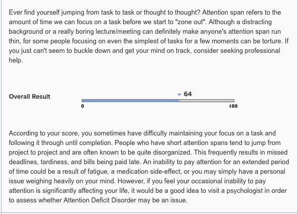

## Personal Information. 
Harrison Schonfelder

S3722929

S3722929@student.rmit.edu.au

Australian of German decent. Grandparents migrated due to tension as WW2 broke out. 

I love going to the AFL, I am a MCC member and have gone to the grand final 5 times.

### Interest in IT

I was always interested in computers and their hardware as there are so many components that all work together to make a computer work. I delved further into this as I made my own gaming computing to play games such as Total War and Civilization V. My IT experience is quite limited, I assisted the IT lead at my Dad’s engineering firm when I was 13 and have disassembled and cleaned dust and other particles out of the computers. 

I chose to come to RMIT because, in my opinion, it has the best location out of any university in Melbourne. As well as my cousin that transferred from Monash to RMIT that she has never looked back.

Going into and throughout my IT course I expect to learn the foundation and fundamentals of the IT industry that will give me a platform to get a job and continue my learning in a related field. 

### Ideal Job

The job advertisememnt: http://grads.woolworths.com.au/page/graduate-roles/

This position interests me as I have worked at Woolworths for nearly 3 years in the deli department and love the social environment of the work. As such, I would love to continue to work at Woolworths in their graduate IT department and learn new skills that would contribute to a flourishing career.  

As this is a graduate position limited knowledge is presumed as a tertiary education provides the basics whilst you learn most of the skills on the job. The skills I currently possess are from jobs that I have held from the age of 14 to now (18 years old). These include being able to file and scan documents, being able to assemble and rotate stock whilst working in a high pressured environment such as McDonalds and working cooperatively in a team environment and abiding by occupational health and safety and food safety to ensure a safe working environment for customers and staff.

I will build upon my skills of customer service and working in a team and apply those to an information technology environment to learn new skills. 

Your Pages site will use the layout and styles from the Jekyll theme you have selected in your [repository settings](https://github.com/HarrySchon123/HarrysIntroProfile/settings). The name of this theme is saved in the Jekyll `_config.yml` configuration file.

### Personal Profile- Test Results

**Myers Briggs Personality Test**- https://www.16personalities.com/free-personality-test

Results of Myers Briggs Test- Protagonist. 

**Learning Style Test**- - https://www.how-to-study.com/learning-style-assessment/quiz-item.asp

Results of Learning Style Test- Visual

**Attention Span Test**- http://psychologytoday.tests.psychtests.com/bin/transfer?req=MTF8MzM2MXwyMTQ4MDA0M3wwfDE=&refempt=1533706768.21480043.11

Result of Attention span test- 64/100

*What do these tests mean for me?* 

I feel that because the result of the test was ‘protagonist’ is a good indicator that the potential of a leadership role in IT further down in my career when I have gathered more experience.  As a result of the online learning test I would convey my messages and ideas in this type of role visually to demonstrate a deeper understanding of the work. 

*How do you think these results may influence your behaviour in a team?*

The results from the Myer Briggs test say that I am extraverted. In a group environment I would be able to freely contribute ideas and speak openly about my concerns. Moreover, I may want to convey my ideas through visual means as well as verbally, as indicated in the learning style test. Furthermore, I may have difficulty working for a long sustained period of time and may need small breaks after long group sessions with my team. 

*How should you take this into account when forming a team?*

From the information gathered from the three tests taken I should look for people with similar social skills and learning patterns. Being in a group with people that are able to communicate and not feel anxious would increase workflow as not one member or members would come across as domineering to the quitter members. Furthermore, I would have to be in a group in which members are willing to be able to break up group meetings to create a better workflow with members who don’t have the attention span for long periods of time. 

### Project ideas 

Overview

My project will be a strategy game run on the Unity which entails a turn based strategy game involving politics. This will be mainly done through a lengthy, strategic campaign for a position in Parliament, slowly working your way up to President. Factors such as manipulation, bribery and backstabbing can all result in an advantage for your character, which can cause various reactions from opponents in the game.  This would create a competitive environment in which would work perfectly for a strategy game. Furthermore, if you are able to seize power your primary goal is to expand your country and influence other countries for your gain. 

Motivation

My main motivation for creating a strategy game is that I have invested many hours into strategy games as it is my favourite game genre. I have invested close to 500 hours into Civilization V and 600 into Total War Shogun 2. As such I think my game is a nice balance between these two games, taking the turn based and political elements from Civilization V and the warfare elements of Total War. Another source of inspiration comes from a love of history of the 20th century. Being able to play as icon politicians such as John F. Kennedy, Hitler and Stalin would provide an ability to abide by history or change it through the multiple outcomes of specific moves. 

Description

Game- As previously mentioned the game will consist of both elements of the civilization and total war strategy game franchises. As this is the game genre I play the most, and know the most about I have a fundamental understanding of what makes a great strategy game. Ideally, it will be challenging enough to retain your attention and keep you entertained yet not too complex that it makes players frustrated and never want to play the game again. An important aspect of most strategy games is it being able to be heavily optimised so it can be played on low spec computers that may be years old. This is a huge feature of strategy games as many players do not have gaming computers. A typical game may go as follows; You pick or create an up and coming politician. You attempt to gain votes through legitimate and illegitimate means, such as good deeds and bribery respectively. This game is designed for anyone who has ever felt as if they could have done a better job than their current politicians in power. This can range from anywhere from your local council to the Prime Minister. At its core the game simulates the motives and desires of a politician wether that be personal or for the betterment of the country. Because Australia is in such political turmoil in that it seems unable to find a fitting leader over the past decade this would create further interest in a political game. 

One of the many signs a strategy game has been successful if it has a positive modding community. A prominent example of a modding community improving and creating additional content for Total War: Empire. Total War Empire was completely broken upon launch but a little over a year later DarthMod for empire was released and completely revolutionised and fixed the problems presented at launch. 7 years later DarthMod is continually used by the competitive community of Empire. Mods also allow a game to be fresh and a allows a game to have more content. This would alleviate pressure to rush a sequel if the game were to be successful as the game making team would be one that is extremely small. 

Tools and Technologies 

The software that I would elect to use to create the game would be Unity was released in late 2011 with an open beta and has been maintained ever since through constant updates, as such, it is a very stable game making software and very easy to learn. The hardware that needs to be utilised to make a game would require a strong CPU, for example, i7 4770k and a dedicated graphics card, such as an 8gb VRAM GTX 1080. Usually when creating games, a minimum of 16gb of ram would help speed the process of creating a game.

Skills Required

Creating a 3D strategy game by yourself would take years upon years. It is very advantageous to work with a small to medium sized team that are willing to all work together towards a goal. A game making team would consist of designers and artists, programmers and voice actors. The hardware needed would typically cost $1500-$2000 per computer. As such, it may be unfeasible for a studio with no backing to financially support all the technological software and hardware needed as there is no guarantee the game will be successful or that it will even be finished, as well as sacrificing your social and work life for the making of the game. 

Outcome

If the game were to be successful I would love for it to have a dedicated hardcode community that are invested in discovering new strategies and ways to win. I would love for it to have a thriving modding and additional content community, as this would always keep the game refreshing and allow other people to contribute and continue to allow the game to flourish. The impact this development will have is hopefully that it will influence other possible developers that are thinking about creating strategy games to create their own, potentially drawing inspiration for crafting mods for the game.

