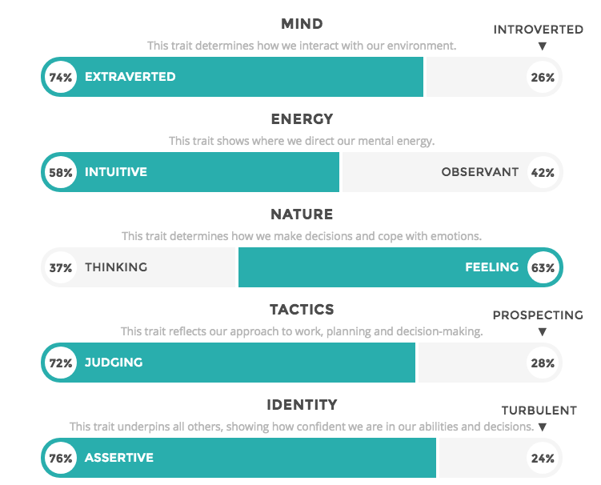

## Personal Information. 
Harrison Schonfelder

S3722929

S3722929@student.rmit.edu.au

Australian of German decent. Grandparents migrated due to tension as WW2 broke out. 

I love going to the AFL, I am a MCC member and have gone to the grand final 5 times.

### Interest in IT

I was always interested in computers and their hardware as there are so many components that all work together to make a computer work. I delved further into this as I made my own gaming computing to play games such as Total War and Civilization V. My IT experience is quite limited, I assisted the IT lead at my Dad’s engineering firm when I was 13 and have disassembled and cleaned dust and other particles out of the computers. 

I chose to come to RMIT because, in my opinion, it has the best location out of any university in Melbourne. As well as my cousin that transferred from Monash to RMIT that she has never looked back.

Going into and throughout my IT course I expect to learn the foundation and fundamentals of the IT industry that will give me a platform to get a job and continue my learning in a related field. 

### Ideal Job

The job advertisememnt: http://grads.woolworths.com.au/page/graduate-roles/

This position interests me as I have worked at Woolworths for nearly 3 years in the deli department and love the social environment of the work. As such, I would love to continue to work at Woolworths in their graduate IT department and learn new skills that would contribute to a flourishing career.  

As this is a graduate position limited knowledge is presumed as a tertiary education provides the basics whilst you learn most of the skills on the job. The skills I currently possess are from jobs that I have held from the age of 14 to now (18 years old). These include being able to file and scan documents, being able to assemble and rotate stock whilst working in a high pressured environment such as McDonalds and working cooperatively in a team environment and abiding by occupational health and safety and food safety to ensure a safe working environment for customers and staff.

I will build upon my skills of customer service and working in a team and apply those to an information technology environment to learn new skills. 

Your Pages site will use the layout and styles from the Jekyll theme you have selected in your [repository settings](https://github.com/HarrySchon123/HarrysIntroProfile/settings). The name of this theme is saved in the Jekyll `_config.yml` configuration file.

### Personal Profile- Test Results

Myers Briggs Personality Test- https://www.16personalities.com/free-personality-test

Results of Myers Briggs Test- Protagonist. 

